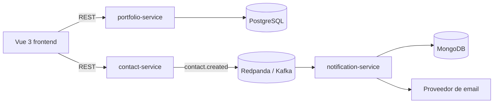

# Javier Crespo | Portfolio fullstack

Portfolio profesional construido como un monorepo fullstack para demostrar desarrollo web, Spring Boot, Vue 3 y arquitectura orientada a eventos.

## Arquitectura



El formulario de contacto no depende directamente del servicio de notificaciones: `contact-service` publica un evento y `notification-service` lo procesa de forma asíncrona. PostgreSQL se reserva para el contenido estructurado del portfolio y MongoDB para el registro de notificaciones.

## Estructura

```text
frontend/
backend/
  portfolio-service/
  contact-service/
  notification-service/
infra/
.github/workflows/
```

## Estado del proyecto

- [x] Fase 1: estructura inicial, documentación y dependencias locales.
- [x] Fase 2: `portfolio-service` con Spring Boot y PostgreSQL.
- [ ] Fase 3: frontend Vue 3 + Vite.
- [ ] Fase 4: `contact-service` y publicación de eventos.
- [ ] Fase 5: `notification-service` y MongoDB.
- [ ] Fase 6: integración end-to-end.
- [ ] Fase 7: CI/CD.
- [ ] Fase 8: despliegue.
- [ ] Fase 9: documentación y capturas finales.

## Requisitos locales

- Docker Desktop con Docker Compose v2.
- Git.
- Java 21 y Node.js LTS serán necesarios a partir de las fases de aplicación.

## Arranque de infraestructura local

1. Copia `.env.example` como `.env`.
2. Ejecuta:

   ```bash
   docker compose up -d
   ```

3. Comprueba el estado:

   ```bash
   docker compose ps
   ```

Para detener los contenedores:

```bash
docker compose down
```

Los datos se conservan en volúmenes Docker. Para eliminarlos también, usa `docker compose down -v`.

## Decisiones y alcance

Kafka/Redpanda es deliberadamente parte de la demostración de arquitectura, aunque sería más infraestructura de la necesaria para un formulario personal. En producción se podrá mantener con un proveedor Kafka compatible o sustituir el transporte por una cola gestionada; el contrato de evento mantendrá desacoplados el contacto y la notificación.

Las credenciales, claves SMTP y valores de producción no se guardan en Git. Usa `.env.example` como contrato de configuración.

## API disponible

Con el stack local arrancado, `portfolio-service` está disponible en `http://localhost:8081`:

- `GET /api/projects` y `GET /api/projects/{id}`: consulta de proyectos.
- `POST`, `PUT` y `DELETE /api/projects/{id}`: operaciones CRUD iniciales para administración local.
- `GET /api/skills`: consulta de tecnologías y habilidades.
- `GET /api/experience`: consulta de experiencia.

El contenido inicial se inserta automáticamente en PostgreSQL cuando las tablas están vacías.

## Licencia

Este proyecto se distribuye bajo la licencia MIT. Consulta [LICENSE](LICENSE).
