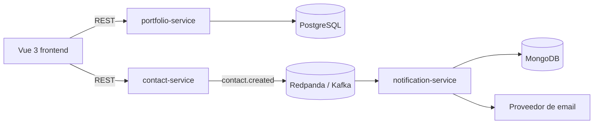

# Javier Crespo | Portfolio fullstack

Portfolio profesional construido como un monorepo fullstack para demostrar desarrollo web, Spring Boot, Vue 3 y arquitectura orientada a eventos.

## Arquitectura



El formulario de contacto no depende directamente del servicio de notificaciones: `contact-service` publica un evento y `notification-service` lo procesa de forma asíncrona. PostgreSQL se reserva para el contenido estructurado del portfolio y MongoDB para el registro de notificaciones.

## Estructura

```text
frontend/
backend/
  portfolio-service/
  contact-service/
  notification-service/
infra/
.github/workflows/
```

## Estado del proyecto

- [x] Fase 1: estructura inicial, documentación y dependencias locales.
- [x] Fase 2: `portfolio-service` con Spring Boot y PostgreSQL.
- [x] Fase 3: frontend Vue 3 + Vite.
- [x] Fase 4: `contact-service` y publicación de eventos.
- [x] Fase 5: `notification-service` y MongoDB.
- [x] Fase 6: integración end-to-end.
- [ ] Fase 7: CI/CD.
- [ ] Fase 8: despliegue.
- [ ] Fase 9: documentación y capturas finales.

## Requisitos locales

- Docker Desktop con Docker Compose v2.
- Git.
- Java 21 y Node.js LTS serán necesarios a partir de las fases de aplicación.

## Arranque de infraestructura local

1. Copia `.env.example` como `.env`.
2. Ejecuta:

   ```bash
   docker compose up -d
   ```

3. Comprueba el estado:

   ```bash
   docker compose ps
   ```

Para detener los contenedores:

```bash
docker compose down
```

Los datos se conservan en volúmenes Docker. Para eliminarlos también, usa `docker compose down -v`.

## Decisiones y alcance

Kafka/Redpanda es deliberadamente parte de la demostración de arquitectura, aunque sería más infraestructura de la necesaria para un formulario personal. En producción se podrá mantener con un proveedor Kafka compatible o sustituir el transporte por una cola gestionada; el contrato de evento mantendrá desacoplados el contacto y la notificación.

Las credenciales, claves SMTP y valores de producción no se guardan en Git. Usa `.env.example` como contrato de configuración.

## API disponible

Con el stack local arrancado, `portfolio-service` está disponible en `http://localhost:8081`:

- `GET /api/projects` y `GET /api/projects/{id}`: consulta de proyectos.
- `POST`, `PUT` y `DELETE /api/projects/{id}`: operaciones CRUD iniciales para administración local.
- `GET /api/skills`: consulta de tecnologías y habilidades.
- `GET /api/experience`: consulta de experiencia.

El contenido inicial se inserta automáticamente en PostgreSQL cuando las tablas están vacías.

`contact-service` está disponible en `http://localhost:8082`:

- `POST /api/contact`: recibe el envío del formulario de contacto (`name`, `email`, `message`). Valida los campos con Bean Validation y responde `400` con el detalle de cada error si algo falla.

Si la validación es correcta, `contact-service` **no escribe en ninguna base de datos**: serializa el evento en JSON y lo publica en el topic Kafka `contact.created` (variable `KAFKA_TOPIC_CONTACT_CREATED`) usando un `KafkaTemplate` contra Redpanda. La respuesta al frontend es `202 Accepted`, porque en ese momento el evento solo se ha publicado, no procesado.

`notification-service` está disponible en `http://localhost:8083`:

- `GET /api/notifications?page=0&size=20`: lista paginada (orden por fecha de recepción descendente) de los mensajes de contacto procesados, tal y como quedaron guardados en MongoDB. Sin autenticación por ahora.

### Flujo end-to-end del formulario de contacto

Esto ya funciona de verdad, de principio a fin, tanto en `npm run dev` como dentro de Docker Compose:

1. La persona rellena el formulario de contacto en la sección `#contact` del frontend (nombre, email, mensaje) y pulsa "Enviar mensaje". El propio formulario valida en el cliente que los campos obligatorios estén rellenos y que el email tenga un formato razonable antes de mandar nada.
2. El navegador hace `POST /api/contact` contra el propio origen del frontend. En `npm run dev` lo resuelve el proxy de Vite (`vite.config.ts`); dentro de Docker Compose lo resuelve Nginx (`frontend/nginx.conf`), que reenvía `/api/contact` a `contact-service` y el resto de `/api/` a `portfolio-service`. El navegador nunca conoce las direcciones internas de los servicios.
3. `contact-service` valida el payload con Bean Validation y, si es correcto, publica un evento `ContactCreatedEvent` (JSON) en el topic Kafka `contact.created` y responde `202 Accepted` de inmediato, sin esperar a que nadie lo procese. Si la validación falla, responde `400` con el detalle de cada campo, que el formulario muestra sin perder lo que la persona ya había escrito.
4. `notification-service` está suscrito a ese topic con un `@KafkaListener`. Al recibir el evento:
   - Guarda un documento en la colección `contact_logs` de MongoDB con estado `RECEIVED`, para no perder el evento aunque falle el paso siguiente.
   - Intenta enviar un email de notificación a `NOTIFICATION_TARGET_EMAIL` vía `JavaMailSender`, usando `SMTP_HOST`, `SMTP_PORT`, `SMTP_USER` y `SMTP_PASSWORD`.
   - Actualiza el mismo documento con el resultado: `EMAIL_SENT` si el envío real tuvo éxito, `EMAIL_FAILED` si SMTP estaba configurado pero el envío falló, o `EMAIL_SIMULATED` si no hay `SMTP_HOST`/`NOTIFICATION_TARGET_EMAIL` configurados en el entorno (caso por defecto en local, donde el intento se deja constancia en los logs de consola en vez de enviar un email real).
5. El frontend muestra un mensaje de confirmación en cuanto recibe el `202 Accepted` y limpia el formulario, sin esperar a que el email se haya enviado de verdad.
6. `GET /api/notifications` permite comprobar en cualquier momento qué mensajes se han procesado y con qué estado, sin necesidad de acceder directamente a MongoDB.

## Frontend local

El frontend está disponible en `http://localhost:5173` cuando se ejecuta con Vite o dentro de Docker Compose. Consume `/api/projects`, `/api/skills` y `/api/experience` de `portfolio-service`, y `/api/contact` de `contact-service`, mediante el proxy configurado en cada entorno, sin exponer las direcciones internas de los servicios al navegador.

El formulario de contacto (sección `#contact`) gestiona los tres estados de la petición: botón deshabilitado con texto "Enviando…" mientras está en curso, mensaje de confirmación y formulario vacío tras un `202 Accepted`, y mensaje de error (validación del cliente, `400` del servidor, o fallo de red) sin borrar lo que la persona ya había escrito.

### Test end-to-end (Playwright)

`frontend/e2e/contact-form.spec.ts` abre el frontend real con un navegador, rellena y envía el formulario de contacto, y comprueba que aparece el mensaje de éxito (caso feliz) y que un email con formato inválido se rechaza sin romper la página ni perder lo escrito (caso de error). Se ejecuta con:

```bash
cd frontend
npm install
npx playwright install chromium   # solo la primera vez
npm run test:e2e
```

Por defecto apunta a `http://localhost:5173` (`E2E_BASE_URL` para cambiarlo), así que el stack debe estar levantado (`docker compose up -d` o `npm run dev`) antes de lanzarlo. Con el stack en Docker, el test ejercita la cadena completa: navegador → Nginx → `contact-service` → Kafka → `notification-service` → MongoDB.

## Licencia

Este proyecto se distribuye bajo la licencia MIT. Consulta [LICENSE](LICENSE).
